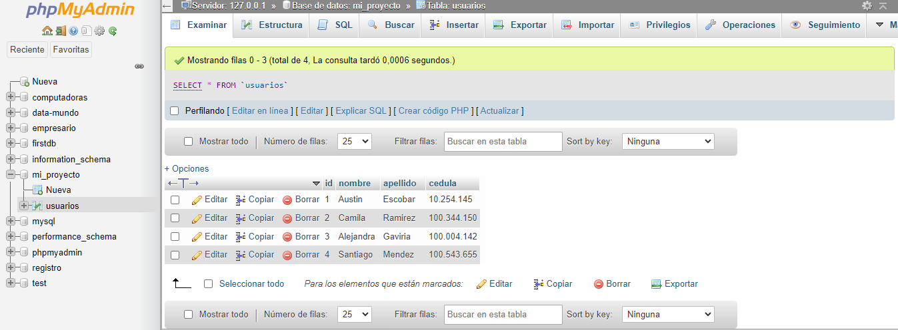

<h1>Taller 10: Gonzalo Franch Escobar</h1>

<h2>Informacíon</h2>

Curso: Full Stack Basico - Grupo 1

<h2>Punto 1: </h2>
<h2>Punto 2: </h2>
<h2>Punto 3: </h2>
<h2>Punto 4: </h2>
<h2>Punto 5-6-7: </h2>
<h3> 5 -Bases de datos</h3>
