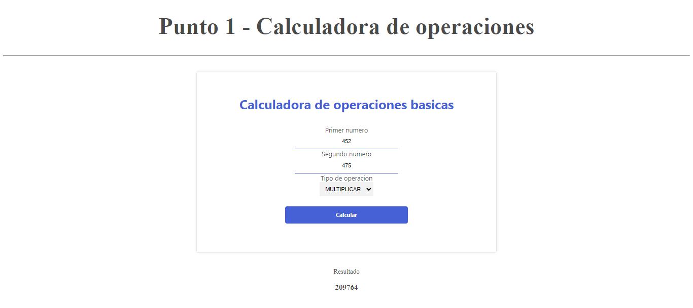
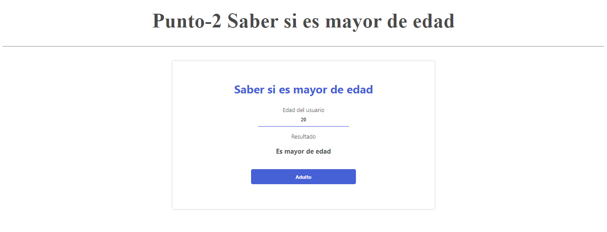
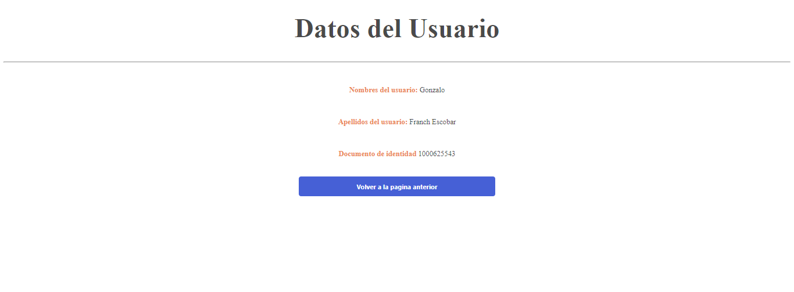
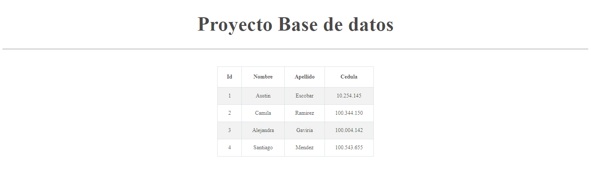

<h1>Taller 10: Gonzalo Franch Escobar</h1>

<h2>Informacíon</h2>

Curso: Full Stack Basico - Grupo 1

<h2>Punto 1: Calculadora operaciones basicas </h2>

<h2>Punto 2: Saber si eres mayor de edad</h2>

<h2>Punto 3: Enviar datos del usuario a una pagina</h2>

<h2>Punto 4: Saber si es mayor de edad con la fecha de nacimiento</h2>

<h2>Punto 5-6-7: </h2>
<h3> 5 -Bases de datos</h3>

<h3> 7 - Muestra de datos en pantalla</h3>

